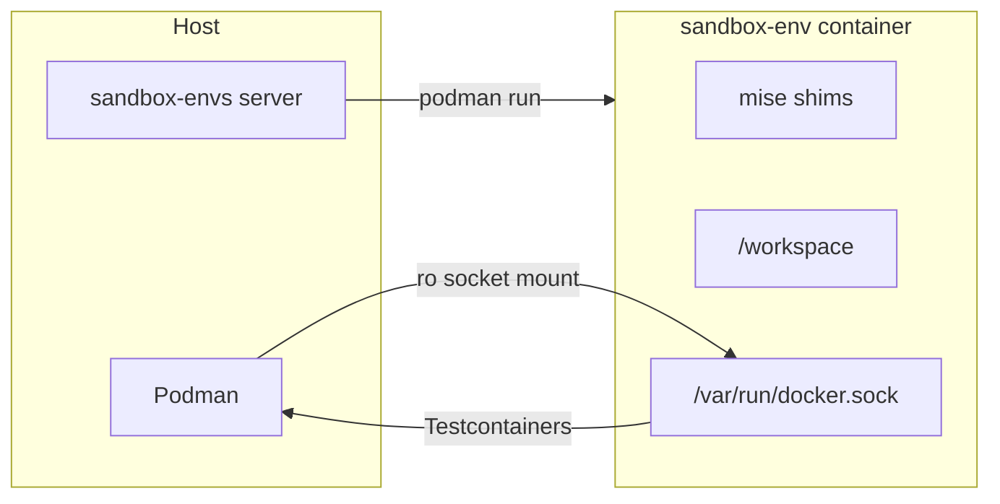

# Sandbox agent image

Design and operations guide for the `sandbox-env` image used by autonomous dependency-upgrade agents.

## Purpose

The image provides a **polyglot build and test environment** inside long-lived Podman sandboxes provisioned by the [sandbox-envs](../README.md) HTTP API. Agents are expected to:

1. Clone a repository into `/workspace`
2. Detect language and toolchain (`.mise.toml`, `go.mod`, `pom.xml`, `package.json`, `pyproject.toml`, etc.)
3. Switch or install runtimes with **mise**
4. Upgrade dependencies, build, run unit and integration tests
5. Commit and open pull requests

## Image profiles

| Profile | Build | Tag example | Pre-installed runtimes | Size (arm64, approx.) |
|---------|-------|-------------|------------------------|------------------------|
| **minimal** (default) | `podman build -t sandbox-env:latest .` | `sandbox-env:latest` | One default per language | ~1.8 GB (arm64 measured) |
| **full** | `podman build --build-arg SANDBOX_PROFILE=full -t sandbox-env:full .` | `sandbox-env:full` | Multiple versions per stack | ~4 GB (arm64 measured) |

Config files:

- [`docker/sandbox-tools.minimal.toml`](../docker/sandbox-tools.minimal.toml)
- [`docker/sandbox-tools.full.toml`](../docker/sandbox-tools.full.toml)

Select profile with build-arg `SANDBOX_PROFILE=minimal` or `full` (default: **minimal**).

## Architecture



- **Runtime management:** [mise](https://mise.jdx.dev) only.
- **Integration tests:** Host API socket mounted at `/var/run/docker.sock` (server default). No Docker-in-Docker.

## Defaults on PATH (both profiles)

| Tool | Version |
|------|---------|
| Go | 1.26.3 |
| Java (Temurin) | 26.0.0 |
| Node.js | 24.16.0 |
| Python | 3.12.10 |
| Maven | 3.9.9 |
| Gradle | 9.5.1 |
| uv | latest at build |
| poetry | pip on Python 3.12 (≥2.4) |
| pnpm | 10.11.0 |
| yarn | 4.9.2 |

## Full profile only (pre-installed extras)

| Stack | Additional versions |
|-------|---------------------|
| Go | 1.24.11, 1.25.8 |
| Java | Temurin 21, 24, 25 |
| Node | 22.22.3, 26.3.0 |
| Python | 3.11.13, 3.13.3 |
| Gradle | 8.14.3 |

## On-demand runtimes (minimal profile)

mise downloads missing versions on first use (`mise exec`, `mise install`). Requires **outbound network** from the sandbox. Installs persist in `/opt/mise` until the container is destroyed.

```bash
# First use may take tens of seconds (JDKs longer)
mise exec java@temurin-21.0.6 -- ./mvnw -q test
mise exec go@1.25.8 -- go test ./...

# After clone, align with repo config
cd /workspace/my-repo
mise install          # reads .mise.toml / tool files
mise exec -- ./gradlew check
```

**Agent recommendation:** After cloning, run `mise install` once when the repo defines tool versions, then use normal commands on `PATH` or `mise exec`.

### Tradeoffs

| | Minimal (default) | Full |
|--|-------------------|------|
| Image size | Smaller | ~2× larger (mostly extra JDKs) |
| First use of rare version | Network + latency | Immediate |
| Reproducibility | Runtime pins at `mise exec` time | Pinned at image build |
| New sandbox | Only defaults baked | Many versions baked |

## Build tooling

| Ecosystem | Tools |
|-----------|--------|
| Java | `mvn`, `gradle` (Gradle 8.x on demand in minimal via `mise exec gradle@8.14.3`) |
| Node | `npm`, `yarn`, `pnpm`; `corepack enable` per-repo if needed |
| Python | `pip`, `uv`, `poetry` |
| Go | `go` toolchain |
| General | git, curl, wget, jq, unzip, zip, make, gcc, g++, openssh-client, rsync, tar, bash |

## Integration test support

Host socket mount (read-only): `DOCKER_HOST` and `TESTCONTAINERS_DOCKER_SOCKET_OVERRIDE` point at `/var/run/docker.sock`. See README for macOS Podman Machine notes.

## Image build

```bash
podman build -t sandbox-env:latest .
podman build --build-arg SANDBOX_PROFILE=full -t sandbox-env:full .
podman build --platform linux/amd64,linux/arm64 -t sandbox-env:latest .
```

**Layer caching:** APT + mise → COPY profile TOML → `mise install` → smoke tests → `/etc/profile.d/sandbox-env.sh`.

## Login shells and `PATH`

Commands via the API use `/bin/sh -lc`. [`/etc/profile.d/sandbox-env.sh`](../Dockerfile) restores mise `PATH` for login shells.

## Maintenance

1. Edit `docker/sandbox-tools.minimal.toml` and/or `docker/sandbox-tools.full.toml`.
2. Rebuild the profile(s) you use.
3. Set `SANDBOX_IMAGE=sandbox-env:full` on the server if switching to the full image.

## Related

- [`specs/sandbox-agent-image.md`](../specs/sandbox-agent-image.md)
- [`internal/sandbox/container_socket.go`](../internal/sandbox/container_socket.go)
